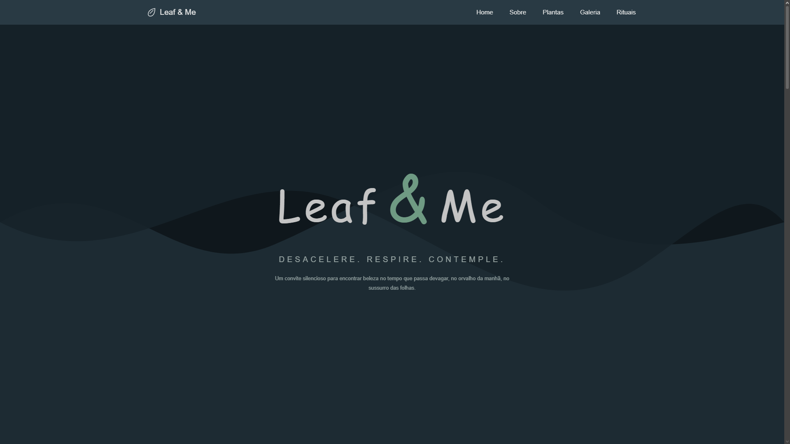

# 🌿 Leaf & Me

O **Leaf & Me** é meu primeiro projeto web, focado em natureza, calma e contemplação visual.

O projeto foi desenvolvido com foco em design limpo, estrutura organizada e uma experiência visual suave. A proposta é criar um espaço digital onde o usuário possa desacelerar, respirar e se conectar com elementos naturais através de um design minimalista e orgânico.

Este projeto representa minha evolução no desenvolvimento front-end, utilizando HTML e CSS para construir uma interface estruturada e visualmente harmônica.

---

## 🛠️ Tecnologias utilizadas

- HTML5  
- CSS3 (organização modular)  
- Git & GitHub  

---

## 🌱 Funcionalidades

- 🍃 Interface minimalista inspirada na natureza  
- 🎨 Layout limpo e bem estruturado  
- 🧩 Arquitetura modular de CSS  
- 📱 Design responsivo (adaptado para mobile)  
- 🌿 Layout com múltiplas seções (Hero, Sobre, Plantas, Galeria, Rituais)  
- 🖼️ Narrativa visual com imagens  
- 🌍 Navegação por âncoras entre seções  

---

## 📸 Screenshots

---

## 📚 O que aprendi

- Como estruturar um projeto front-end com múltiplas seções  
- Organização de CSS com arquitetura escalável  
- Hierarquia visual, espaçamento e composição  
- Criação de interfaces com foco em estética e calma  
- Fundamentos de design responsivo  
- Uso do Git e GitHub para versionamento  
- Construção de um sistema visual consistente  

---

## 🚀 Objetivo do projeto

O objetivo do Leaf & Me é explorar como interfaces digitais podem transmitir calma, equilíbrio e conexão com a natureza através do design visual e da estrutura do conteúdo.

---

## 👨‍💻 Autor

Desenvolvido por **João Paulo**

🔗 GitHub: https://github.com/jaozinpaulin  

---

## 🌿 Status

🟢 Meu primeiro projeto web
